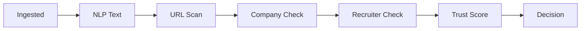

<p align="center">
  
</p>

<p align="center">
  
  
  
  <a href="SECURITY.md"></a>
  <a href="CODE_OF_CONDUCT.md"></a>
</p>

<p align="center">
  <a href="LICENSE"><strong>MIT License</strong></a> •
  <a href="CODE_OF_CONDUCT.md"><strong>Code of Conduct</strong></a> •
  <a href="CONTRIBUTING.md"><strong>Contributing Guidelines</strong></a> •
  <a href="SECURITY.md"><strong>Security Policy</strong></a>
</p>

---

# ScamShield: Fake Job Posting Detection Platform

**ScamShield** is an advanced, real-time AI/ML platform designed to protect job seekers from fraudulent employment opportunities. By actively auditing job descriptions, verifying URLs and corporate registrations, and analyzing recruiter contact channels, ScamShield calculates a comprehensive **Trust Score (0-100%)** before applicants submit their sensitive data.

---

## 🎥 Demo Video

[](https://youtu.be/W4LjWAeOBSo)

*Click the image above to watch a full demonstration of ScamShield in action.*

---

## ✨ Key Features

- **Real-Time Threat Detection**: Instantaneous analysis of job postings to identify potential scams.
- **Smart URL Scraping**: Automatically fetches and populates job details (title, company, description) from major job boards for seamless analysis.
- **5-Pillar Trust Engine**: Employs a multi-faceted verification pipeline incorporating machine learning and heuristic risk metrics.
- **Premium Visual Dashboard**: A sleek, responsive user interface featuring a dynamic horizontal pipeline tracker, theme toggling (Obsidian Dark / Alabaster Light), and detailed trust telemetry.

---

## 🛠️ System Architecture

ScamShield evaluates job postings using a **7-Stage Horizontal Verification Pipeline**:



The system verifies credibility across **5 Trust Pillars**:

1. **🧠 NLP Text Analysis**:
   - Evaluates semantics using a high-performance machine learning text classifier.
   - Audits vocabulary density and detects clickbait signals (e.g., excessive exclamation marks).
   - Analyzes lexical complexity via the **Flesch Reading Ease** index to expose convoluted, machine-generated templates.
2. **🔗 URL Phishing Scan**:
   - Inspects embedded links for secure SSL protocols (`https://` vs `http://`).
   - Audits domains against suspicious free hosting providers (e.g., WordPress, Wix) and URL shorteners (e.g., bit.ly).
3. **🏢 Company Verification**:
   - Validates description completeness to flag exceptionally brief or missing company profiles.
   - Audits company names against official corporate registry structures (identifying standard suffixes like *Ltd*, *Inc*, *LLP*, *Pvt*).
4. **🛡️ Recruiter Behavior Check**:
   - Scans for embedded personal emails and phone numbers in the description text.
   - Distinguishes between public free email providers (e.g., `@gmail.com`) and validated corporate domains.
   - Cross-references job locations against historical regional fraud ratios.
   - Flags pressure tactics and urgency terms (e.g., *"URGENT"*, *"IMMEDIATE"*).
5. **🎯 Trust Score Engine**:
   - Integrates machine learning probabilities and heuristic risk metrics to compute a credibility rating (**0 to 100%**).
   - 🟢 **80% - 100%**: High Trust (Verified Safe / Approved)
   - 🟡 **50% - 79%**: Neutral Risk (Verification Advised)
   - 🔴 **Below 50%**: Low Trust (Scam Vulnerability Alert / Application Blocked)

---

## 📈 Model Performance & Telemetry

Our core prediction models have been meticulously engineered to maximize prediction accuracy and minimize false-positive warning triggers. 

- **Text Classifier (NLP)**: Upgraded to `TfidfVectorizer` (10,000 max features) combined with an `SGDClassifier(loss='log_loss')`. Trained on balanced sets using `SMOTE`, filtering vocabulary noise and raising the individual text F1-score to **80.97%**.
- **Tabular Classifier**: Utilizes a powerful `RandomForestClassifier` (100 estimators) to naturally model non-linear correlations (e.g., location threat ratios, character lengths, Flesch scores) without scaling bias, achieving an individual tabular F1-score of **56.32%**.
- **Ensemble Fusion (Soft Voting)**: Combines model outputs using a weighted soft-voting algorithm (`0.5 * Text Risk + 0.5 * Tabular Risk`) combined with a heuristic check penalty.

**Overall Ensemble Performance:**
- **Accuracy**: 98.11%
- **Precision**: 89.86% *(Significantly reducing false alarm flags)*
- **Recall**: 80.52%
- **F1 Score**: 84.93%

---

## 🚀 Quick Start Guide

### 1. Prerequisites

Ensure you have Python 3.12+ installed. Install the required dependencies:

```bash
pip install -r requirements.txt
```
*(Or install manually: `pip install flask pandas numpy scikit-learn imbalanced-learn joblib textstat beautifulsoup4 nltk python-docx`)*

### 2. Train the Models

Train and serialize the TF-IDF vectorizers and Random Forest classifiers on the provided balanced dataset. 

```bash
python train_model.py
```
*This step outputs accuracy metrics and saves the binary model files (`tfidf_vectorizer.pkl`, `clf_log.pkl`, `clf_num.pkl`, `numeric_features.pkl`) into the `models/` directory.*

### 3. Launch the Application

Start the Flask development server:

```bash
python app.py
```
Navigate to **`http://127.0.0.1:5000`** in your web browser to access the ScamShield dashboard.


## 🤝 Contributing

We welcome contributions to ScamShield! Please see our [Contributing Guidelines](CONTRIBUTING.md) for more details on how to get started, report bugs, or submit pull requests.

## 📄 License

This project is licensed under the [MIT License](LICENSE).
